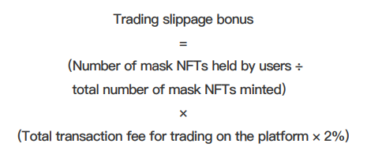

# Trading Slippage Bonus

The handling fee generated by each transaction automatically slips by 2%, and the user with the mask NFT can share the slippery point income equally。

Calculation formula

<figure><figcaption></figcaption></figure>

Example&#x20;

If the number of masks NFT held by a user is 10, the total number of masks cast is 6000, and the transaction fee for buying and selling the platform is 1 million, the slippery point dividend available to the user is: (10÷600) × (1 million×2%) =333.33 USDT.
